# ⚖️ VN Legal RAG - Vietnam AI Legal Assistant

[](https://www.python.org/)
[](https://fastapi.tiangolo.com/)
[](https://streamlit.io/)
[](https://qdrant.tech/)
[](https://langchain.com/)

A production-ready Retrieval-Augmented Generation (RAG) system built specifically for Vietnamese legal retrieval and question answering. The project implements **Hybrid Search** (Dense + Sparse), **Vietnamese Legal Text Splitting**, **Cross-Encoder Reranking with ViRanker**, and **Streaming Response**.

## Key Features

### Advanced Retrieval Pipeline

* **Hybrid Search**: Combines dense embeddings (semantic) + sparse vectors (BM25)

  * *Dense*: `GreenNode/GreenNode-Embedding-Large-VN-Mixed-V1` (1024-dim)
  * *Sparse*: `Qdrant/bm25` (FastEmbed)
* **Cross-Encoder Reranking**: Uses `namdp-ptit/ViRanker` - a reranking model optimized for Vietnamese
* **Two-Stage Retrieval**: Top-30 candidates → ViRanker → Top-5 documents

### Vietnamese Legal Text Processing

* **Vietnamese Legal Text Splitter**: Regex-based splitter following the structure:

  * **Chương** (Chapter) - context header
  * **Điều** (Article) - primary boundary
  * **Khoản** (Clause) - secondary split
* **Parent-Child Strategy**: Child chunks for search, parent documents for the LLM
* **Unified Storage**: Store parent content in Qdrant payload

### Performance

* **True Async**: `AsyncQdrantClient` for non-blocking FastAPI
* **Streaming Response**: Server-Sent Events (SSE) token-by-token
* **Parallel Ingestion**: Multi-threaded document processing

## System Architecture

```mermaid
graph TB
    subgraph Frontend
        User[👤 User]
        UI[🖥️ Streamlit]
    end

    subgraph Backend
        API[⚡ FastAPI]
        Stream[📡 SSE Stream]
    end

    subgraph RAG["RAG Pipeline"]
        subgraph Retrieval
            Embed[🔢 Embeddings]
            Search[🔍 Hybrid Search]
            QD[(Qdrant)]
        end
        
        subgraph Rerank
            VR[🎯 ViRanker]
        end
        
        subgraph Generate
            CTX[📄 Context]
            LLM[🤖 Gemini]
        end
    end

    User --> UI --> API
    API --> Embed --> Search --> QD
    QD --> VR --> CTX --> LLM
    LLM --> Stream --> UI --> User

    style VR fill:#4CAF50,color:#fff
    style QD fill:#932259,color:#fff
    style LLM fill:#4285F4,color:#fff
```



## Processing Flow


## Tech Stack

| Component            | Technology                              |
| -------------------- | --------------------------------------- |
| **LLM**              | Google Gemini 2.5 Flash Lite            |
| **Dense Embedding**  | GreenNode-Embedding-Large-VN (1024-dim) |
| **Sparse Embedding** | Qdrant/BM25 (FastEmbed)                 |
| **Reranker**         | namdp-ptit/ViRanker                     |
| **Vector DB**        | Qdrant (Hybrid mode)                    |
| **Backend**          | FastAPI + Uvicorn                       |
| **Frontend**         | Streamlit                               |
| **Orchestration**    | LangChain 0.3                           |

## Installation

### Requirements

* Python 3.10+
* [uv](https://github.com/astral-sh/uv) (recommended) or pip
* Docker (for Qdrant)
* NVIDIA GPU + CUDA (recommended)
* Google API Key

### 1. Clone & Install

```bash
git clone https://github.com/duongtruongbinh/legal-rag.git
cd legal-rag
uv sync
```

### 2. Configuration

Create a `.env` file:

```ini
GOOGLE_API_KEY=your_api_key_here

# Qdrant
QDRANT_URL=http://localhost:6333
QDRANT_COLLECTION=legal_hybrid_v3

# Models
EMBEDDING_DEVICE=cuda
RERANKER_DEVICE=cuda

# Retrieval
RETRIEVAL_TOP_K=30
RERANKER_TOP_N=5
```

### 3. Start Qdrant

```bash
docker run -p 6333:6333 -v $(pwd)/qdrant_storage:/qdrant/storage qdrant/qdrant
```

### 4. Run the Application

```bash
# Backend
uvicorn src.api.server:app --reload --port 8000

# Frontend (new terminal)
streamlit run frontend/ui.py
```

## Data Ingestion

```bash
# Via API
curl -X POST http://localhost:8000/ingest \
  -H "Content-Type: application/json" \
  -d '{"batch_size": 100, "max_workers": 8}'

# Via Python
python -m src.rag.ingestion
```

## API Endpoints

| Method | Endpoint         | Description               |
| ------ | ---------------- | ------------------------- |
| `GET`  | `/health`        | Health check              |
| `POST` | `/chat`          | RAG query (full response) |
| `POST` | `/chat/stream`   | RAG query (SSE streaming) |
| `POST` | `/ingest`        | Trigger ingestion         |
| `GET`  | `/ingest/status` | Ingestion status          |

### Streaming Example

```bash
curl -X POST http://localhost:8000/chat/stream \
  -H "Content-Type: application/json" \
  -d '{"query": "Mức phạt vượt đèn đỏ?"}' \
  --no-buffer
```

Response (SSE):

```
data: {"type": "sources", "data": [...]}
data: {"type": "token", "data": "Theo"}
data: {"type": "token", "data": " quy định"}
...
data: {"type": "done"}
```

## Project Structure

```
legal-rag/
├── src/
│   ├── api/
│   │   ├── routers/
│   │   │   ├── chat.py          # Chat endpoints + streaming
│   │   │   └── ingest.py        # Ingestion endpoint
│   │   ├── schemas.py           # Pydantic models
│   │   └── server.py            # FastAPI app
│   ├── core/
│   │   ├── config.py            # Settings
│   │   └── vector_db.py         # Qdrant connection
│   ├── rag/
│   │   ├── chain.py             # LangChain RAG chain
│   │   ├── retriever.py         # HybridRerankerRetriever + ViRanker
│   │   └── ingestion.py         # VietnameseLegalTextSplitter
│   └── templates/
│       ├── contextualize.jinja  # Query reformulation
│       └── qa_system.jinja      # System prompt
├── frontend/
│   └── ui.py                    # Streamlit UI
├── pyproject.toml
└── README.md
```

## Configuration

| Setting             | Default | Description                             |
| ------------------- | ------- | --------------------------------------- |
| `RETRIEVAL_TOP_K`   | 30      | Number of candidates from hybrid search |
| `RERANKER_TOP_N`    | 5       | Number of documents after reranking     |
| `PARENT_CHUNK_SIZE` | 2000    | Max chars/parent chunk                  |
| `CHILD_CHUNK_SIZE`  | 512     | Max chars/child chunk                   |
| `LLM_TEMPERATURE`   | 0.1     | Generation randomness                   |

## Credits

* **GreenNode** - Vietnamese embedding models & legal corpus
* **namdp-ptit** - ViRanker Vietnamese reranking model
* **LangChain** & **Qdrant** - Core infrastructure
* **Zalo AI** - Original legal text retrieval dataset